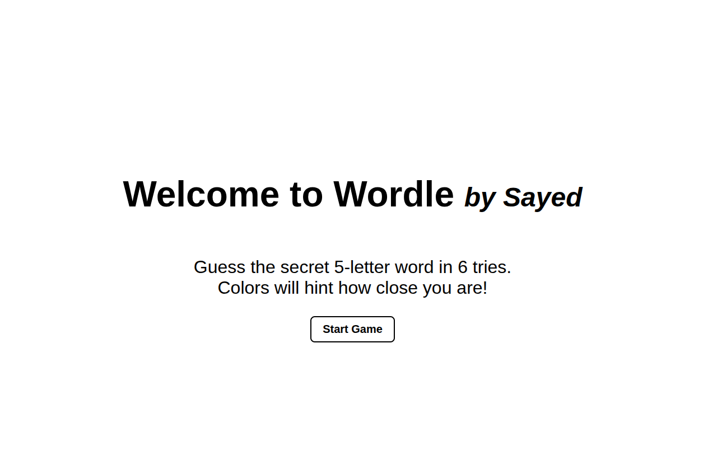
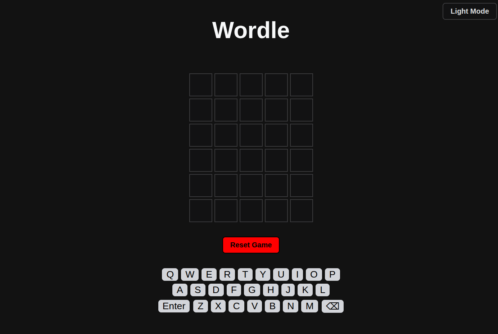

## Project Name
Wordle
## Technologies Used
* **HTML**: Used to build the structure of the game, including the landing page, the grid board, and the interactive on-screen keyboard.
* **CSS**: Handled all the styling, the smooth color transitions when tiles reveal hints, and the dark mode theme.
* **JavaScript**: Written in pure JS to handle the game logic, keep track of rows and columns, validate user guesses, and update the UI dynamically.
## Description
This is a fully playable web clone of the popular daily word game, Wordle. When you load the game, you're greeted with a welcome screen that introduces the rules. Once you hit start, the game transitions smoothly to the main board. Players get 6 attempts to guess a secret 5-letter word. The game uses a custom algorithm to check your guess against the answer, changing the tile colors in real-time (green for the right spot, yellow for the wrong spot, and gray if the letter isn't in the word). It supports both physical keyboard typing and mouse clicks on the custom virtual keyboard, and includes a dark mode toggle and a fully functioning reset button to start a fresh game instantly.
## User Stories
1. As a user i want to see a clean 5*6 grid of empty tiles to know the game is ready. 
2. As a user i want to know which letter is in the right place, which is in the word and which is not.
3. As a user i want to be blocked from typing more than 5 letters 
4. As a user i want to use the backspace to delete letters.
5. As a user i want to press enter after locking in my word. 
## Screenshots
### Welcome Screen

### Gameplay (Dark Mode Enabled)

## Future Enhancements
* **Dictionary API Validation**: Integrate a live third-party dictionary API to prevent players from entering fake or random strings of letters as valid guesses.
* **CSS Keyframe Animations**: Add fluid 3D tile-flipping animations when a guess is submitted, and row-shaking visual effects for invalid words.
## Credits
Shout out to Mr Omar Kamal and Ahmed Abdulla they helped a lot 